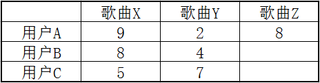
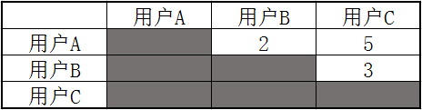

# 推荐算法 - 协同过滤

协同过滤是一种推荐算法，它是一种解决特定问题的思路，而非一种固定算法，所以它可以有多种实现，各种实现略有差异，本文将用通俗的方式帮助你了解它的原理，并给出一个应用的实例。 

## 理解协同过滤

假如我有一个跟我品味相似的朋友，大多数时候，我喜欢听的歌他也喜欢，这时就可以把那些我喜欢的而他没有听过的歌，推荐给他，反之，他也可以推荐给我。 这里有两个关键指标，一个是需要知道我对每首歌的喜欢程度，还有就是哪些人与我品味相似。 图解一下：



上表有ABC三人，与XYZ三首歌，数字表示用户给歌曲的评分（满分为10），也表示用户对歌曲的喜欢程度，例如：用户A对歌曲X的喜欢程度为9。而用户A与用户B可以认为是品味相似，因为用户AB同时喜欢歌曲X，且同时不太喜欢歌曲Y。这时就可以将用户A喜欢的歌曲Z推荐给用户B。 

## 计算用户相关性

关于这个问题，网上大多都提到了“欧几里得距离”以及“皮尔逊相关系数”这两个方法，相信这两种方法的相应实现，网上也能找到一大把，不过我想以另一种方法来说明一下，还是以上面的表为例，我们以每首歌为单为，求出所有用户对每首歌的评价的相似性，如下： 
* 所有用户对歌曲X评价的相似性：


计算规则：用户A对X的评分为9，用户B对X的评分为8，求出它们的差的绝对值，也就是1，值越小相关性越强。依此类推求出剩下人的相关性。灰色部分的值是重覆的，因此略过。 
* 所有用户对歌曲Y评价的相似性：



* 将上面两张表合并，也就是将他们的值合并起来：


这张表上的值表示：A与B的相关性最强，B与C其次，A与C相关性则最差。 当然，我们可以将上表中的结果提取出来做个排序，这样当A有了喜欢的新歌时，根据每个用户与A的相关性排序，应优先推荐给B，其次是C。而当C有了喜欢的新歌时，优先推荐给B，其次才是A。 

## 使用Spark MLLib中的ALS算法

上面只是帮助你理解协同过滤的核心思想，而实际的实现有多种，而且也比较复杂，不过在Spark的机器学习库中已经有相应的实现，也就是ALS算法，我们只需提供数据集，可以很容易的使用，下面就来演示一下它的用法。 

### 生成测试数据
```
package com.algorithm.matrix
 
import scala.util.Random
import java.io.PrintWriter
 
/**
 * 此类用来生成一些测试数据并写入到指定的文件中
 */
object GenFile {
   
  //模拟歌手列表
  val artists = Array("李健","吉克隽逸","吴莫愁","杨坤","宋祖英","罗大佑","龙梅子",
    "水木年华","小沈阳","谭晶","蔡健雅","刘佳","王蓉","黄龄","庞麦郎","钟汉良")
   
  //模拟用户列表
  val user = Array("q","w","e","r","t","y","u","i","o","p","a","s")
   
  //创建一个随机对象
  val random = Random
   
  /**
   * 定义一个函数，用随机的的方式模拟出某用户听了某歌手的歌，并给出评分
   * 生成数据格式为：用户ID，歌手ID，评分
   */
  def genLine() = {
    val ad = artists(random.nextInt(artists.length)).hashCode()
    val ud = user(random.nextInt(user.length)).hashCode()
    val count = random.nextInt(30) + 1
    s"$ud,$ad,$count"
  }
   
  def main(args: Array[String]): Unit = {
     
    //创建文件对象
    val file = new PrintWriter("D:/Downloads/user_artists.log")
     
    //生成1000条评价，每条为一行，写入文件中
    for(i <- 0 to 1000){
      val str = genLine
      file.println(str)
    }
     
    file.close()
     
  }
   
}
```
上面代码用来生成一些模拟数据，这个不是必须的，可以用自己的方法得到数据，生成完以后就可以上传到HDFS中，比如： `hdfs:///test/user_artists.log` 这个位置。当然只是测试的话也可以放在本地，然后以本地模式启动Spark来运行。 

### 构建模型
```
package com.algorithm.matrix
 
import org.apache.spark.mllib.recommendation._
import org.apache.spark.SparkConf
import org.apache.spark.SparkContext
 
object MusicReferee {
   
  def main(args: Array[String]): Unit = {
     
    //初始化Spark应用基本对象
    val sc = new SparkContext(new SparkConf())
     
    //模拟歌手列表，在这里起到字典作用，下面会根据ID取出对应的歌手
    val artists = Array("李健","吉克隽逸","吴莫愁","杨坤","宋祖英","罗大佑","龙梅子",
    "水木年华","小沈阳","谭晶","蔡健雅","刘佳","王蓉","黄龄","庞麦郎","钟汉良")
     
    //作用同上
    val user = Array("q","w","e","r","t","y","u","i","o","p","a","s")
     
    //通过歌手id取出对应名字
    def getArti(id: Int) = {
      artists.find { x => x.hashCode() == id }.get
    }
     
    //定义一个函数，可以通过用户id取出对应名字
    def getUser(id: Int) = {user.find { x => x.hashCode() == id }.get}
     
    //从HDFS上加载测试数据文件
    val arr = sc.textFile("hdfs:///test/user_artists.log")
     
    //将文件中的每一行数据封装成一个评定对象(用户,产品,评分)
    val trainData = arr.map { x => 
      val Array(userId, artistsId, count) = x.split(",").map { x => x.toInt }
      Rating(userId, artistsId, count)
    }.cache()
     
    //用Spark机器学习库中的ALS算法分解并生成我们想要的模型
    //后面是生成模型时需要的参数，具体含义请看Spark官方文档
    val model = ALS.trainImplicit(trainData, 10, 5, 0.01, 1.0)
     
    //打印出其中一个用户A收听过的所有歌手
    arr.filter { x => 
      x.split(",")(0).equals("98") 
    }.map { x => 
      val s = x.split(",")
      ("b",getArti(s(1).toInt),s(2))
    }.repartition(1).sortBy(f => f._3).foreach(println)
     
    //得知用户A听谁的歌较多,然后向他推荐5个歌手
    val artiOfUser = model.recommendProducts(98, 5)
     
    //转换成可读形式并打印出来
    artiOfUser.map(x => println((x.user,getArti(x.product),x.rating)))
     
     
  }
   
}
```
然后打成JAR包后向Spark提交就可以了，这个模型有很多参数可以微调，不同参数对最终结果有较大影响，具体的使用细节请参考Spark官方：https://spark.apache.org/docs/latest/mllib-collaborative-filtering.html#collaborative-filtering

-End-

关于
---

__作者__：张佳军

__阅读__：43

__点赞__：1

__创建__：2017-06-11
